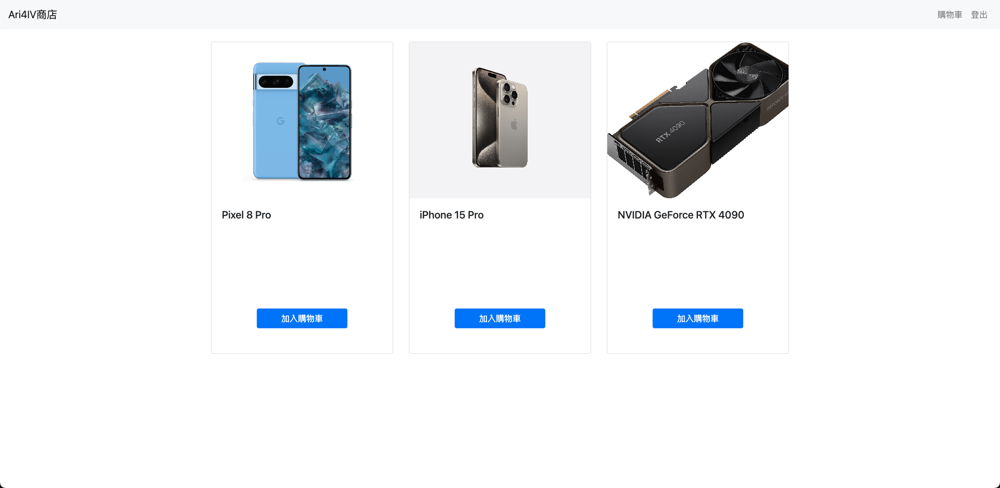
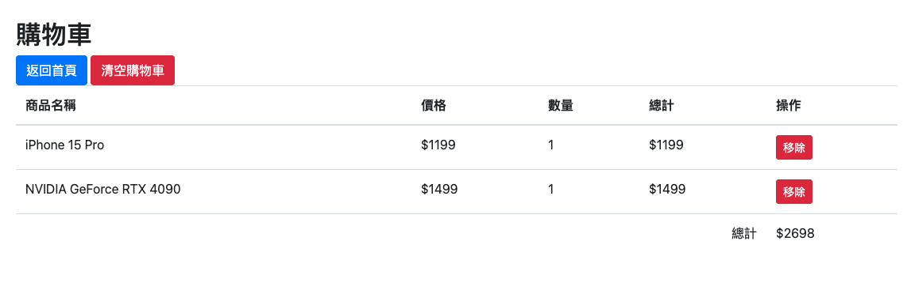

# PHP-SESSION

# 專案介紹
這項專案是一個使用 PHP 和 Bootstrap 建立的購物車系統。它利用 PHP 的 Session 特性來保持使用者在購物過程中的狀態，並允許使用者瀏覽商品、將商品添加到購物車中，以及管理購物車內容。

#主要功能
1. 商品瀏覽：使用者可以查看一系列的商品。
2. 購物車管理：使用者可以將商品添加到購物車，查看購物車內容，並對其中的商品進行增加、減少或移除操作。
3. 使用者登入/登出：系統提供使用者登入和登出功能，用於管理購物車和訂單。
4. 工作階段管理：透過 PHP Session 來跟蹤使用者的購物車和身份狀態。

## 瀏覽商品列表
1. 可將商品加入購物車

## 購物車
1. 查看購物車內容
2. 移除購物車中的商品
3. 清空購物車

